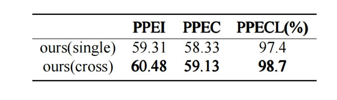
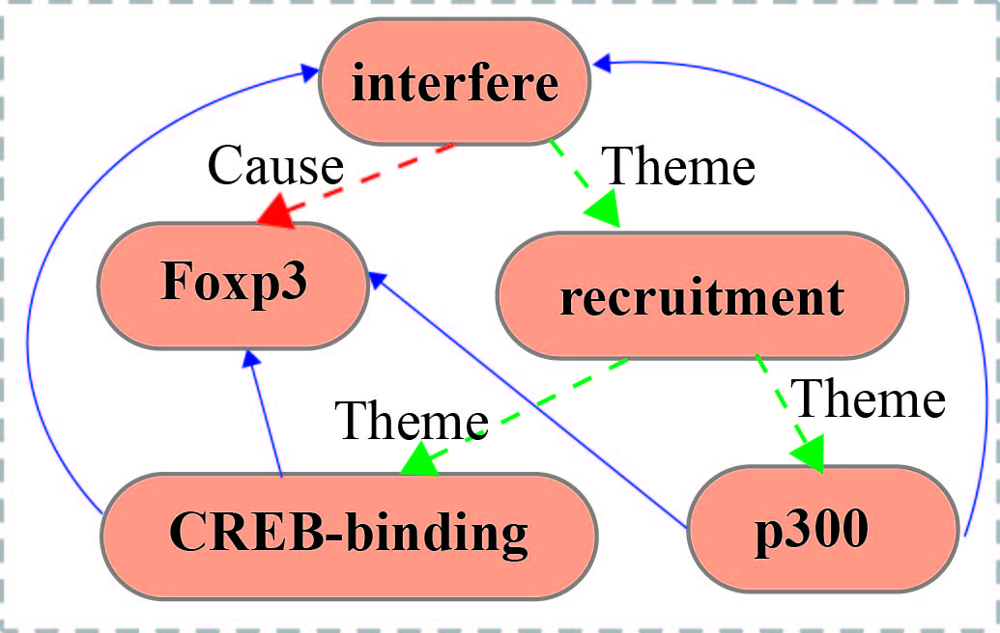
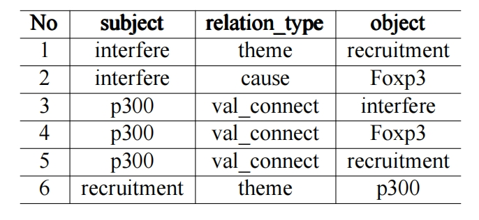

# Entity and Relation Extraction
Based on pure and a special relation, this project attempts to extract a nested event from the relation, and proposes solutions for nested events below three arguments, trigger nested extraction in relation extraction and sub-event overlapping extraction in event extraction.


## introduce
The dotted red line indicates the Cause relationship, the dotted green line indicates the Theme relationship, and the solid blue line indicates the val_connect relationship. By selecting one of the nested events, the "p300" connection with the val_connect relation type and "recruitment" and the "recruitment" connection with the theme relation type and "p300" fully identify the nested child event. "p300" determines that the nested subevent belongs to the nested event by connecting with "interfere" through the val_connect relation type, "interfere" with "recruitment" through the theme relation type, and the determination of the nested subevent. "Foxp3" corresponding to the Cause relation type can be the object of both the cause relation type of "interfer" and the val_connect relation type of "p300".

This project can determine that "Foxp3" is the corresponding argument of "interfer". And confirmed his uniqueness. You can see that the nested event is uniquely determined by the trigger "interfere" and the argument "p300" of the nested child event, giving a unique result. However, there is a problem that each additional relationship construction forms one ring after another, which will affect the result of relationship extraction. Therefore, the idea of pure model is adopted here to carry out each relationship extraction independently, so as to ensure that each relationship can be effectively extracted

## setup

### Install dependencies
Please install all the dependency packages using the following command:
```
pip install -r requirements.txt
```

### Download and preprocess the datasets
Our experiments are based on three datasets: genia11. Please find the links and pre-processing below:
* genia11: We use the preprocessing code from [genia11](https://bionlp-st.dbcls.jp/GE/2011/downloads/).

## Quick Start
The trained model can be downloaded from here. You need to unzip decompress it before running the program.

```bash

# Run the pre-trained entity model, the result will be stored in ${genia11_ent_model}/ent_pred_test.json
python run_entity.py \
    --do_eval --eval_test \
    --context_window 0 \
    --task scierc \
    --data_dir ${genia11_dataset} \
    --model allenai/scibert_scivocab_uncased \
    --output_dir ${genia11_ent_model}

# Run the pre-trained full relation model
python run_relation.py \
  --task scierc \
  --do_eval --eval_test \
  --model allenai/scibert_scivocab_uncased \
  --do_lower_case \
  --context_window 0\
  --max_seq_length 128 \
  --entity_output_dir ${genia11_ent_model} \
  --output_dir ${genia11 _rel_model}
  
# Output end-to-end evaluation results
python run_eval.py --prediction_file ${genia11_rel_model}/predictions.json


## Entity Model

### Input data format for the entity model

The input data format of the entity model is JSONL. Each line of the input file contains one document in the following format.
```
{
    "doc_key": 1032887401,
    "sentences": [
        [
            "\n",
            "Recent",
            "studies",
            "have",
            "shown",
            "that",
            "the",
            "non",
            "-",
            "steroidal",
            "anti",
            "-",
            "inflammatory",
            "drugs",
            "(",
            "NSAIDs",
            ")",
            "activate",
            "heat",
            "shock",
            "transcription",
            "factor",
            "(",
            "HSF1",
            ")",
            "from",
            "a",
            "latent",
            "cytoplasmic",
            "form",
            "to",
            "a",
            "nuclear",
            ",",
            "DNA",
            "binding",
            "state",
            "."
        ]
    ],
    "ner": [
        [
            [
                23,
                23,
                "Protein"
            ],
            [
                17,
                17,
                "Positive_regulation"
            ],
            [
                35,
                35,
                "Binding"
            ]
        ]
    ],
    "relations": [
        [
            [
                17,
                17,
                35,
                35,
                "Theme"
            ],
            [
                23,
                23,
                17,
                17,
                "val_connect"
            ],
            [
                35,
                35,
                23,
                23,
                "Theme"
            ],
            [
                23,
                23,
                35,
                35,
                "val_connect"
            ]
        ]
    ]
}
```

### Train/evaluate the entity model

You can use `run_entity.py` with `--do_train` to train an entity model and with `--do_eval` to evaluate an entity model.
A trianing command template is as follow:
```bash
python run_entity.py \
    --do_train --do_eval [--eval_test] \
    --learning_rate=1e-5 --task_learning_rate=5e-4 \
    --train_batch_size=16 \
    --context_window {100} \
    --task {genia11} \
    --data_dir {directory of preprocessed dataset} \
    --model {allenai/scibert_scivocab_uncased} \
    --output_dir {directory of output files}
```
Arguments:
* `--learning_rate`: the learning rate for BERT encoder parameters.
* `--task_learning_rate`: the learning rate for task-specific parameters, i.e., the classifier head after the encoder.
* `--context_window`: the context window size used in the model. `0` means using no contexts. In our cross-sentence entity experiments, we use `--context_window 100` for SciBERT models.
* `--model`: the base transformer model. We use `allenai/scibert_scivocab_uncased` for SciERC.
* `--eval_test`: whether evaluate on the test set or not.

The predictions of the entity model will be saved as a file (`ent_pred_dev.json`) in the `output_dir` directory. If you set `--eval_test`, the predictions (`ent_pred_test.json`) are on the test set. The prediction file of the entity model will be the input file of the relation model.

## Relation Model
### Input data format for the relation model
The input data format of the relation model is almost the same as that of the entity model, except that there is one more filed `."predicted_ner"` to store the predictions of the entity model.
```bash
{
    "doc_key": 889290301,
    "sentences": [
        [
            "Comparative",
            "analysis",
            "identifies",
            "conserved",
            "tumor",
            "necrosis",
            "factor",
            "receptor",
            "-",
            "associated",
            "factor",
            "3",
            "binding",
            "sites",
            "in",
            "the",
            "human",
            "and",
            "simian",
            "Epstein",
            "-",
            "Barr",
            "virus",
            "oncogene",
            "LMP1",
            "."
        ]
    ],
    "ner": [
        [
            [
                4,
                11,
                "Protein"
            ],
            [
                24,
                24,
                "Protein"
            ]
        ]
    ],
    "relations": [
        [

        ]
    ],
    "list_length": [
        0
    ],
    "predicted_ner": [
        [
            [
                4,
                11,
                "Protein"
            ],
            [
                24,
                24,
                "Protein"
            ]
        ]
    ],
    "predicted_relations": [
        [

        ]
    ]
}
```

### Train/evaluate the relation model:
You can use `run_relation.py` with `--do_train` to train a relation model and with `--do_eval` to evaluate a relation model. A trianing command template is as follow:
```bash
python run_relation.py \
  --task {genia11} \
  --do_train --train_file {path to the training json file of the dataset} \
  --do_eval [--eval_test] [--eval_with_gold] \
  --model {allenai/scibert_scivocab_uncased} \
  --do_lower_case \
  --train_batch_size 32 \
  --eval_batch_size 32 \
  --learning_rate 2e-5 \
  --num_train_epochs 10 \
  --context_window {100} \
  --max_seq_length {128} \
  --entity_output_dir {path to output files of the entity model} \
  --output_dir {directory of output files}
```
Aruguments:
* `--eval_with_gold`: whether evaluate the model with the gold entities provided.
* `--entity_output_dir`: the output directory of the entity model. The prediction files (`ent_pred_dev.json` or `ent_pred_test.json`) of the entity model should be in this directory.

The prediction results will be stored in the file `predictions.json` in the folder `output_dir`, and the format will be almost the same with the output file from the entity model, except that there is one more field `"predicted_relations"` for each document.

You can run the evaluation script to output the end-to-end performance  (`Ent`, `Rel`, and `Rel+`) of the predictions.
```bash
python run_eval.py --prediction_file {path to output_dir}/predictions.json
```


## Pre-trained Models
We release our pre-trained entity models and relation models for genia11 datasets.

*Note*: the performance of the pre-trained models might be slightly different from the reported numbers in the paper, since we reported the average numbers based on multiple runs.

### Pre-trained models for genia11
* [SciBERT (cross, W=300)](https://nlp.cs.princeton.edu/projects/pure/scierc_models/ent-scib-ctx300.zip) (391M): Cross-sentence entity model based on `allenai/scibert_scivocab_uncased`
  
